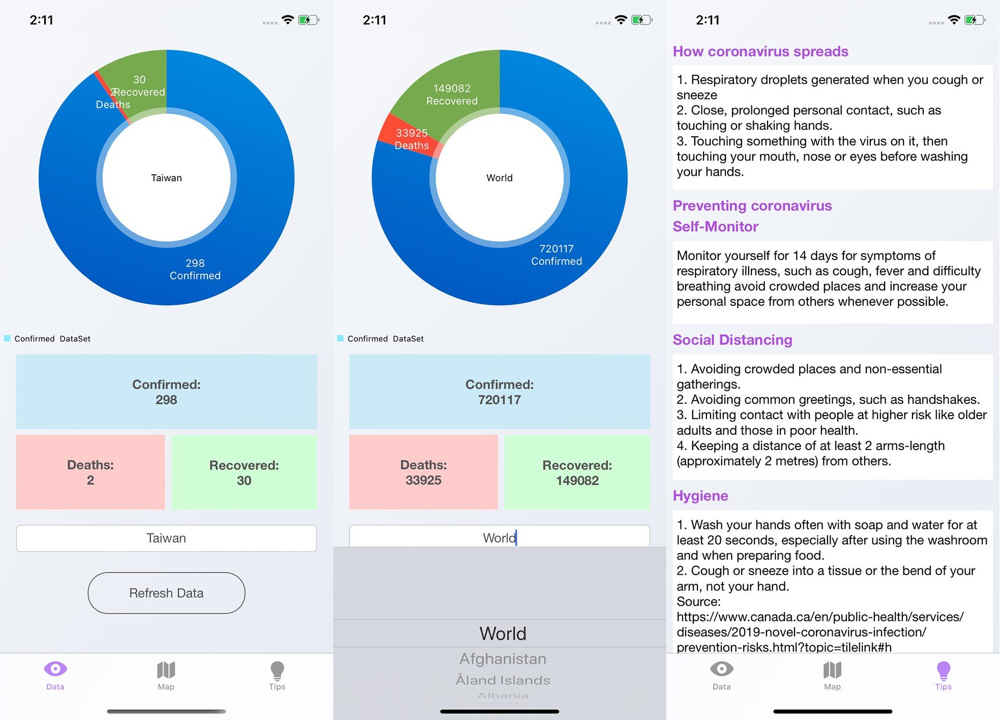

# COVID-19 Real-Time Outbreak Tracker
This app displays real-time data of confirmed, deaths and recovered cases of the novel coronavirus (COVID-19).

Written in Swift 5, works well with iOS 13.1+, iPhone 11/XR screen size

Future work:
- Set constraints for different screen sizes
- Using map kit to display data on a global map
- Using charts to display outbreak history

Lastly, big thanks to all API and external libraries authors!

API Used: https://github.com/backtrackbaba/covid-api

Libraries Used:

Charts : https://github.com/danielgindi/Charts

SwiftyJson : https://github.com/SwiftyJSON/SwiftyJSON

